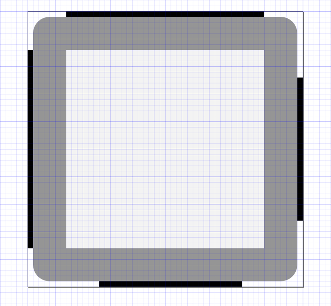

# Piel - Java utilities to create images an atlas for many resolutions using SVG

Creating images resources for multiple device resolutions is always a pain. **Piel** makes easier that providing a set of tools to: 

* Generate PNG images and 9 patches in multiple resolutions from SVGs
* Create images atlas
* Generate fonts in .fnt format for multiple resolutions with different sizes
* Generate complete skins combining images, 9 patches and ttf fonts
* Tools available as Java classes and as Maven plugins

## Apache License 2.0

## Maven dependency

If you want to use **Piel** as a library, you must add the following dependency to your `pom.xml`:

```xml
<dependency>
	<groupId>es.e-ucm.maven.plugins</groupId>
	<artifactId>piel</artifactId>
	<version>1.2.1</version>
</dependency>
```

## Generating PNGs from SVGs

Suppose you have the following project layout:

```
myproject
    + svg
        - circle.svg
        - triangle.svg
    + 9patch
        - button.svg
```

And you want to generate pngs for 3 scales: 1, 2 and 0.5. Using **Piel** you'd obtain: 

```
myproject
    + svg
        - circle.svg (50x50)
        - triangle.svg (100x100)
    + 9patch
        - button.svg (30x30 + 2x2 9 patch border = 32x32)
    + png
        - scale1.0
            - circle.png (50x50)
            - triangle.png (100x100)
            - button.9.png (30x30 + 2x2 9 patch border = 32x32)
        - scale2.0
            - circle.png (100x100)
            - triangle.png (200x200)
            - button.9.png (60x60 + 2x2 9 patch border = 62x62)
        - scale0.5
            - circle.png (25x25)
            - triangle.png (50x50)
            - button.9.png (15x15 + 2x2 9 patch border = 17x17)
```

**NOTICE ABOUT 9 PATCHES**: To generate 9 patches correctly, borders marking margin and padding in the 9 patch must be of **exactly 1 px** in the source svg, and must be **inside** the view box area of svg. Example:



### Using Java

```java
new GeneratePNGs().execute("/myproject/svg", "/myproject/9patch", "/myproject/png", new String[]{"1", "2", "0.5"});
```

### Using Maven plugin

```xml
<build>
    <plugins>
        <plugin>
            <groupId>es.e-ucm.maven.plugins</groupId>
            <artifactId>piel</artifactId>
            <version>1.2.1</version>
            <executions>
                <execution>
                    <phase>clean</phase>
                    <goals>
                        <goal>pngs</goal>
                    </goals>
                    <configuration>
                        <svgDir>${basedir}/svg</svgDir>
                        <ninePatchDir>${basedir}/9patch</ninePatchDir>
                        <outputDir>${basedir}/png</outputDir>
                        <scales>
                            <scale>1</scale>
                            <scale>2</scale>
                            <scale>0.5</scale>
                        </scales>                    
                    </configuration>
                </execution>                
            </executions>
        </plugin>
    </plugins>
</build>
```

## Generating .fnt from TTFs

Suppose you have the following project layout:

```
myproject
    + Roboto.ttf
``

And you want to generate .fnt files for Roboto.ttf, for sizes 14 and 47, and you want them in scales 1 and 2, to obtain:

```
myproject
    + Roboto.ttf
    + fonts
        + scale1.0
           - Roboto-14.fnt
           - Roboto-14.png
           - Roboto-47.fnt
           - Roboto-47.png
        + scale2.0
           - Roboto-14.fnt (This is equivalent to Roboto 28 in scale 1.0)
           - Roboto-14.png
           - Roboto-47.fnt (This is equivalent to Roboto 94 in scale 1.0)
           - Roboto-47.png
``

### Using Java

```java
// svg directory or 9 patch directory can be null
new GenerateFonts(new File[]{"Roboto.ttf"}, new File[]{"fonts"}, new String[]{"1", "2"}, new String[]{"14", "47"}, 1024).execute();
```

### Using Maven plugin

```xml
<build>
    <plugins>
        <plugin>
            <groupId>es.e-ucm.maven.plugins</groupId>
            <artifactId>piel</artifactId>
	        <version>1.2.1</version>
            <executions>
                <execution>
                    <phase>clean</phase>
                    <goals>
                        <goal>fonts</goal>
                    </goals>
                    <configuration>
                        <ttfs>
                            <ttf>${basedir}/Roboto.ttf</ttf>
                        </ttfs>
                        <outputDir>${basedir}/fonts</outputPngDir>
                        <scales>
                            <scale>1</scale>
                            <scale>2</scale>
                        </scales>                    
                        <sizes>
                            <size>14</size>
                            <size>47</size>
                        </sizes>
                        <atlasSize>1024</atlasSize>
                    </configuration>
                </execution>                
            </executions>
        </plugin>
    </plugins>
</build>
```


## Generating atlas

Suppose you have the following project layout:

```
myproject
    + png
        - scale1.0
            - circle.png (50x50)
            - triangle.png (100x100)
            - button.9.png (30x30 + 2x2 9 patch border = 32x32)
        - scale2.0
            - circle.png (100x100)
            - triangle.png (200x200)
            - button.9.png (60x60 + 2x2 9 patch border = 62x62)
        - scale0.5
            - circle.png (25x25)
            - triangle.png (50x50)
            - button.9.png (15x15 + 2x2 9 patch border = 17x17)
```

And now you want to generate an atlas for each folder, to obtain: 

```
myproject
    + png
        - scale1.0
            - circle.png (50x50)
            - triangle.png (100x100)
            - button.9.png (30x30 + 2x2 9 patch border = 32x32)
        - scale2.0
            - circle.png (100x100)
            - triangle.png (200x200)
            - button.9.png (60x60 + 2x2 9 patch border = 62x62)
        - scale0.5
            - circle.png (25x25)
            - triangle.png (50x50)
            - button.9.png (15x15 + 2x2 9 patch border = 17x17)
    + atlas
        - scale1.0
            - images.atlas
            - images.png
        - scale2.0
            - images.atlas
            - images.png
        - scale0.5
            - images.atlas
            - images.png
```

### Using Java

```java
// svg directory or 9 patch directory can be null
new GenerateAtlas("/myproject/png", "/myproject/atlas", TextureFilter.Linear, 1024, "images").execute();
```

### Using Maven plugin

```xml
<build>
    <plugins>
        <plugin>
            <groupId>es.e-ucm.maven.plugins</groupId>
            <artifactId>piel</artifactId>
	        <version>1.2.1</version>
            <executions>
                <execution>
                    <phase>clean</phase>
                    <goals>
                        <goal>atlas</goal>
                    </goals>
                    <configuration>
                        <sourceDir>${basedir}/png</sourceDir>
                        <outputDir>${basedir}/atlas</outputDir>
                        <filter>Linear</filter>
                        <size>1024</size>
                        <atlasName>images</atlasName>
                    </configuration>
                </execution>                
            </executions>
        </plugin>
    </plugins>
</build>
```

## Skins - Bringing all together

Finally, you can create a complete skin, with atlas containing images, nine patches and fonts using the `GenerateSkins` utility. 

Suppose you have the following project layout:

```
myproject
    + Roboto.ttf
    + images
        - photo.png
    + svg
        - circle.svg
        - triangle.svg
    + 9patch
        - button.svg
```

And you want to generate resources of scale 1 and 2, and font sizes of 14 and 47:

```
myproject
    + images
        - photo.png (80x80)
    + svg
        - circle.svg (50x50)
        - triangle.svg (100x100)
    + 9patch
        - button.svg (30x30 + 2x2 9 patch border = 32x32)
    + png
        - scale1.0
            - photo.png (80x80)
            - circle.png (50x50)
            - triangle.png (100x100)
            - button.9.png (30x30 + 2x2 9 patch border = 32x32)            
            - Roboto-14.fnt
            - Roboto-14.png
            - Roboto-47.fnt
            - Roboto-47.png
        - scale2.0
            - photo.png (160x160)
            - circle.png (100x100)
            - triangle.png (200x200)
            - button.9.png (60x60 + 2x2 9 patch border = 62x62)
            - Roboto-14.fnt (This is equivalent to Roboto 28 in scale 1.0)
            - Roboto-14.png
            - Roboto-47.fnt (This is equivalent to Roboto 94 in scale 1.0)
            - Roboto-47.png            
    + skin (atlas include font atlas and images from image folder)
        - scale1.0
            - Roboto-14.fnt
            - Roboto-47.fnt
            - skin.atlas
            - skin.png
        - scale2.0
            - Roboto-14.fnt
            - Roboto-47.fnt
            - skin.atlas
            - skin.png
```

### Using Java

```java
new GenerateSkins("/myproject/images", "/myproject/svg", "/myproject/9patch", "/myproject/png", new String[]{"1", "2", "0.5"}, new File[]{"Roboto.ttf"}, new String[]{"14", "47"}, TextureFilter.Linear, 1024, "skin", "myproject/skins").execute();
```

### Using Maven plugin

```xml
<build>
    <plugins>
        <plugin>
            <groupId>es.e-ucm.maven.plugins</groupId>
            <artifactId>piel</artifactId>
	        <version>1.2.1</version>
            <executions>
                <execution>
                    <phase>clean</phase>
                    <goals>
                        <goal>skins</goal>
                    </goals>
                    <configuration>
                        <svgDir>${basedir}/svg</svgDir>
                        <ninePatchDir>${basedir}/9patch</ninePatchDir>
                        <outputPngDir>${basedir}/png</outputPngDir>
                        <scales>
                            <scale>2</scale>
                            <scale>1</scale>
                        </scales>
                        <ttfs>
                            <ttf>${basedir}/Roboto.ttf</ttf>
                        </ttfs>
                        <fontSizes>
                            <fontSize>14</fontSize>
                            <fontSize>47</fontSize>
                        </fontSizes>
                        <outputDir>${basedir}/skin</outputDir>
                        <size>1024</size>
                        <filter>Linear</filter>
                        <atlasName>skin</atlasName>
                    </configuration>
                </execution>
            </executions>
        </plugin>
    </plugins>
</build>
```
